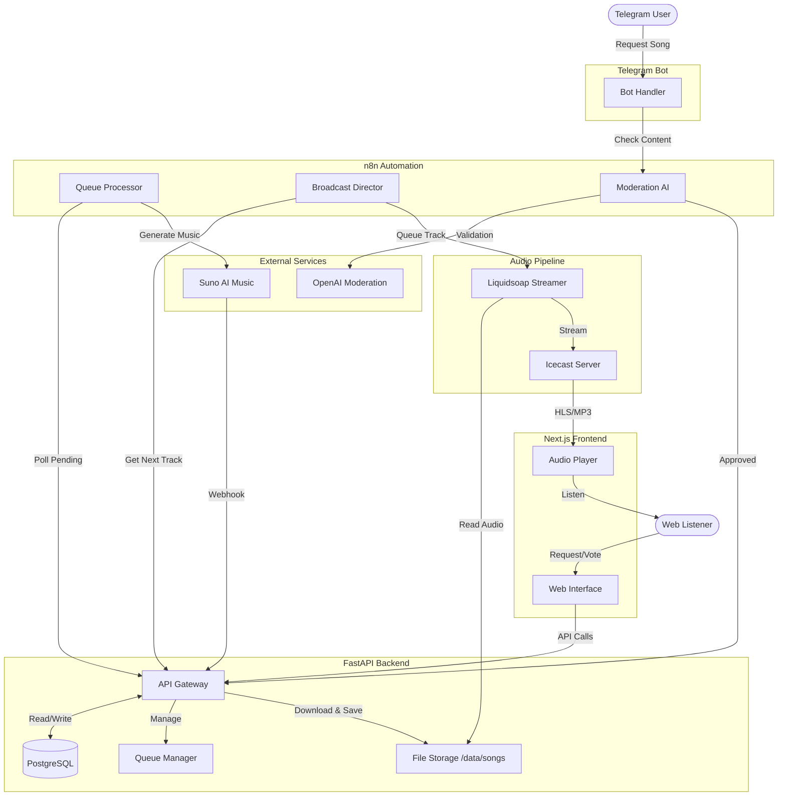

# PYrte Radio Shack Architecture

This document outlines the high-level architecture and data flow of the PYrte Radio Shack system.

## System Flow Diagram

## Component Interactions

1. **Request Flow**:
    * Users submit prompts via Telegram or Web.
    * Requests are moderated (n8n + OpenAI) before entering the queue.
    * Approved requests are stored in PostgreSQL via the FastAPI Backend.

2. **Generation Flow**:
    * The **Queue Processor** (n8n) polls the API for pending requests.
    * It triggers **Suno AI** to generate audio.
    * Upon completion, Suno calls a webhook in the API.
    * The API downloads the generated audio to local storage (`/data/songs`).

3. **Broadcast Flow**:
    * The **Broadcast Director** (n8n) determines the next track from the queue.
    * It instructs **Liquidsoap** to queue the audio file.
    * Liquidsoap streams the audio to **Icecast**.
    * The Frontend connects to Icecast to play the stream for listeners.
